#Node.js
###一、hello world
*  在sublime text中输入
```  
console.log('Hello World')
```
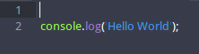
######保存为.js 后缀的文件名，在终端输入文件所在的位置，然后“运行node+文件名” 命令：

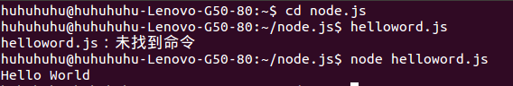

###二、express
**1. expres框架**
(1.) express的功能：

* 路由控制；
* 模板解析支持；
* 动态视图；
* 用户会话；
* CSRF 保护；
* 静态文件服务；
* 错误控制器；
* 访问日志；
* 缓存；
* 插件支持；

**2. 安装express**
(1.)在google chrome中搜索“ubuntu14.04安装express4”关键字，进入"[ubuntu nodejs + express4.x 安装 测试](http://blog.csdn.net/ivanx_cc/article/details/46827291)"

(2.)根据教程中指示在终端输入命令，
* 安装express4.x，需要先执行以下配置 
```
npm config set registry http://registry.npmjs.org/
```
* 然后再进行安装（因为新版express-generator 与expres 分开了，所以要执行以下两个命令）
```
npm install express -g
npm install -g express-generator
```
* 安装完成后可以使用** express -V** 命令查看版本。
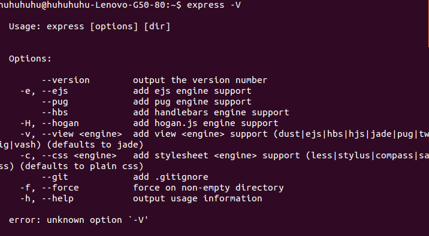
* 建立工程
通过以下命令建立网站基本结构:
```
express -t ejs microblog
```
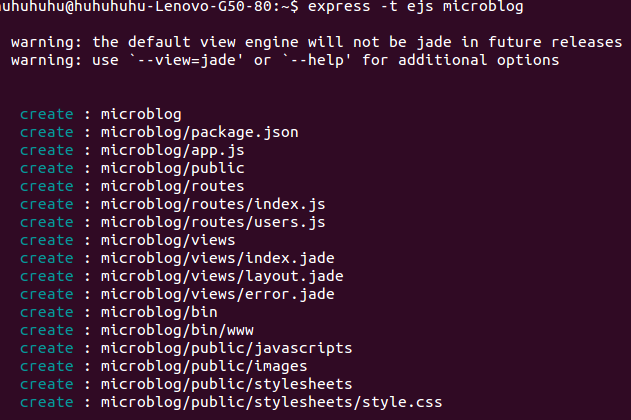

* 创建文件夹（与上一步同理）
	* 在终端输入命令 express -e noejs添加文件夹。
	
* npm install

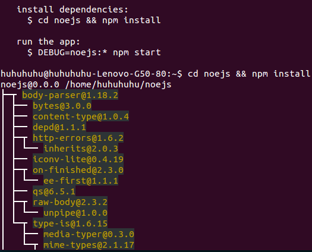
>提示我们要进入其中运行 npm install(自动安装了依赖 ejs 和 express)

* 检查package.json文件，文件内容显示如下：

>其中 dependencies 属性中有 express 和 ejs 。无参数的 npm install 的功能就是检查当前目录下的 package.json,并自动安装所有指定的依赖。

* npm start 运行express
* ctrl+c 结束运行

>这样启动一个服务就成功了， 可以通过 localhost：3000 在浏览器中访问欢迎页面。

**3. 运行express**
(1.)打开刚才新创建的 noejs文件夹下roultes文件夹中的index.js文件。
 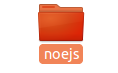
  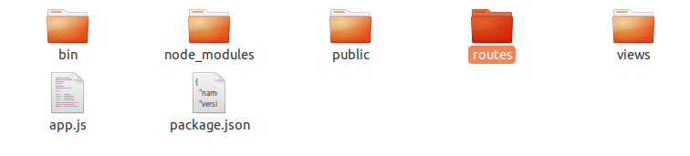
  
* 打开后文件内容如下图所示（此文件用于修改页面内容）。
 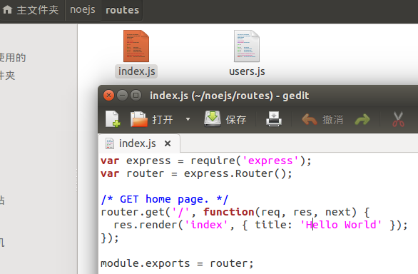
 routes 是一个文件夹形式的本地模块,即 ./routes/index.js ,它的功能是为指定路径组织返回内容,相当于 MVC 架构中的控制器。
* 关闭此文件，打开noejs文件夹下的另一文件夹views中的index.ejs 文件,此文件中显示了内容的格式，关闭。
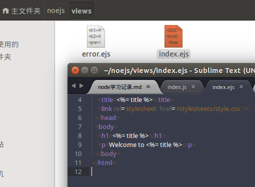
ejs (Embedded JavaScript) 是一个标签替换引擎,其语法与 ASP、 PHP 相似,易于学习,目前被广泛应用。 Express默认提供的引擎是 jade,它颠覆了传统的模板引擎,制定了一套完整的语法用来生成 HTML 的每个标签结构,功能强大但不易学习。
* 打开终端（ctrl+alt+t），输入命令打开noejs文件夹（cd+文件夹名），再输入noejs文件夹下运行express的命令（npm + start），打开浏览器输入网址：*localhost：3000*，输入ctrl+c 关闭express；


**启动服务器，内容显示如下：**
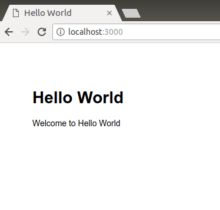

**4. 注意！！！**
* 当重新修改代码后，需要重启服务器才能呈现出更改后的效果，或者可以使用 supervisor 实现监视代码修改和自动重启。

**5. <t style="color:red">三个 app.configure 函数:(分别指定了通用、开发和产品环境下的参数。)</t>**
* 第一个 app.configure 直接接受了一个回调函数,后两个则只能在开发和产品环境中调用。
* app.set 是 Express 的**参数设置工具**,接受一个键(key)和一个值(value),可用的参数如下所示：
*  basepath :基础地址,通常用于 res.redirect() 跳转。
* views :视图文件的目录,存放模板文件。
* view engine :视图模板引擎。
* view options :全局视图参数对象。
* view cache :启用视图缓存。
* case sensitive routes :路径区分大小写。
* strict routing :严格路径,启用后不会忽略路径末尾的“ / ”。
* jsonp callback :开启透明的 JSONP 支持。
6. app.configure中启用的五个中间件：
* bodyParser：功能是解析客户端请求，通常是POST发送的内容。
* methodOverride：用于支持定制的HTTP的方法。
* router：是项目的路由支持。
* static：提供静态文件支持。
* errorHandler：错误控制器。
二. 文件夹的意义
1. bin ------目录：www文件更改端口
2. node_modules ------模板
3. public ---- image 存储图片，javascripts 存储js文件，stylesheets 页面风格存储CSS文件

# mac系统安装node.js
一、首先进入[node.js官网](https://nodejs.org/en/)中下载一个软件包,选择“macOS Install（.pkg）  64-bit”


1.下载完成后直接双击下载的文件进行安装。

（1）安装完成后打开终端（Finder-->应用程序-->实用工具-->终端），输入“node -v”，安装完成后会出现node.js的版本


（2）** 第二种方法：**根据node.js官网中DOWLOAD下的 [通过软件包管理器安装Node.js](https://nodejs.org/en/download/package-manager/)对 mac OS系统安装node.js的方法，进行安装：


* 首先打开终端输入以下代码：

```
curl "https://nodejs.org/dist/latest/node-${VERSION:-$(wget -qO- https://nodejs.org/dist/latest/ | sed -nE 's|.*>node-(.*)\.pkg</a>.*|\1|p')}.pkg" > "$HOME/Downloads/node-latest.pkg" && sudo installer -store -pkg "$HOME/Downloads/node-latest.pkg" -target "/"

```


** 错误提示：**

* wget命令没有发现
* rl：（35）服务器终止SSL运行


* 再次重新输入代码后，出现新的错误


# 如何在mac安装nvm
* 打开终端输入下载安装nvm的命令（从github下载）
```
curl -o- https://raw.githubusercontent.com/creationix/nvm/v0.33.1/install.sh | bash
```

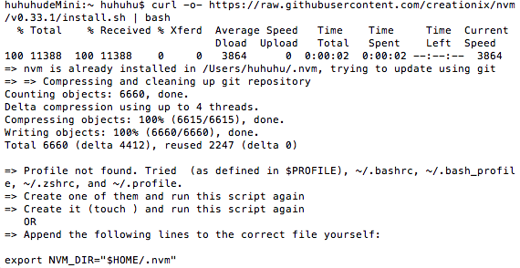

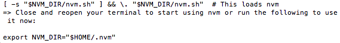

* 下载完成后，nvm暂时还不能使用，需要输入以下命令来配置环境变量

```
$ export NVM_DIR="$HOME/.nvm"

$ [ -s "$NVM_DIR/nvm.sh" ] && \. "$NVM_DIR/nvm.sh"

```

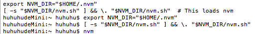

* 配置完成后，输入

```
$ nvm
```

* 若出现以下信息则表示nvm已经安装配置成功并可以运行了

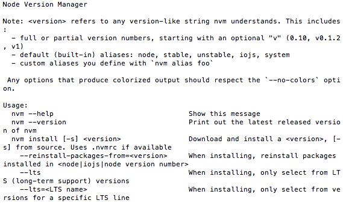

* 然后输入"$ nvm install 6.9.0"安装 node v6.9.0版本，安装完成后输入"node -v"，查看目前node.js的版本，

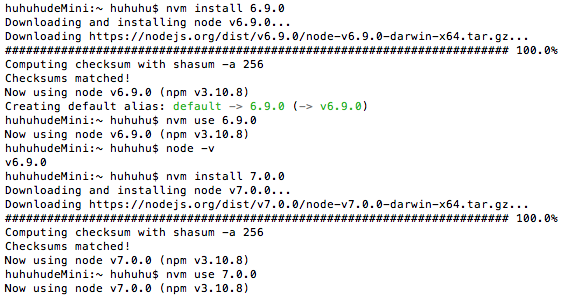

* 再输入"$ nvm install 7.0.0"，安装node.js 7.0.0版本，然后输入"nvm use 7.0.0"将目前的使用版本更换为node.js 7.0.0版本，再次输入"$ node -v"查看当前版本已变为"v7.0.0",然后将node.js用同样的方法更换为原有的v8.9.0版本

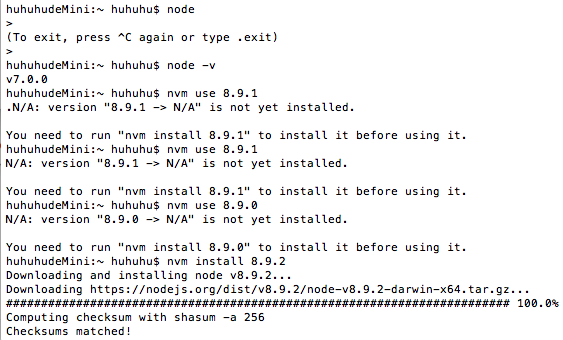

* 再用上述方法下载最新版本v8.9.2，并输入"nvm use 8.9.2"更换为目前最新版本的node.js，此外还可以输入"nvm ls"查看目前下载完成的node.js的版本

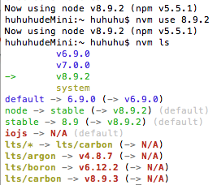


#在Ubuntu14.04虚拟机中安装node.js

一、首先进入Google浏览器搜索[node.js官网](https://nodejs.org/en/),进入**DOWNLOADS**页面，单击**DOWNLOAD**页面下方的“Installing Node.js via package manager”选项，进入官网中的[linux安装教程](https://nodejs.org/en/download/package-manager/)；


(1)根据教程中的步骤，首先我们打开终端并输入一条“curl --silent --location https://rpm.nodesource.com/setup_9.x | sudo bash -”的命令，输出后系统自动下载了最新的node.js的安装包；


* 在执行此命令中出现“部分索引文件下载失败”的错误，


