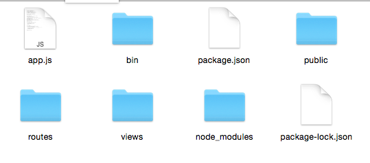
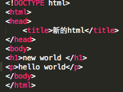

# 在mac系统安装express
1、首先打开终端新建一个文件夹，输入“ cd Desktop ”，也就是打开桌面，然后再在桌面创建新的文件夹，由于mac系统权限问题，所以只能显示出桌面上的文件，输入新建文件夹命令
```
$ mkdir express

```
 2、然后输入express的安装的命令,输入密码，安装完成后则显示express的版本信息和安装信息；

```
$ sudo npm install -g express

```


3、然后在输入以下命令对安装好的express进行配置

```
$ npm install express-generator -g

```

* 在配置过程中出现如下错误，错误提示为:用户权限不够无法进行全局配置，


** 结决方案：**

* 通过管理员权限运行，更改为如下代码，安装完成后出现配置的路径、版本和安装信息等；

```
$ sudo -s npm install express-generator -g

```


4、然后继续在终端输入"express",会出现"destination is not empty,continue?[y/N]"的提示，输入"y"后回车，继续安装


5、加载完以后再输入"npm start"开始运行express，再次出现错误，错误提示如下图：


* 翻看上一步命令的安装提示，发现没有安装dependencies（依赖），所以根据上面的命令提示输入" $ cd . && npm install " 命令；

```
 $ cd . && npm install

```


6、当express安装完成后，你可以重新进入一次express

* 首先，你需要从在终端进入你刚才安装express的文件夹下，然后输入" npm start ",终端就会出现express的安装路径等信息


* 然后在打开浏览器，输入地址为"localhost:3000"（默认地址），就会显示你当前运行的node.js的内容


* 最后"Ctrl+c"可以关闭express(所以系统下皆为此方法关闭express)，express中的.js文件被更改时都需要重启express才能运行

# 如何使用express
1、打开sublime text 3，然后将安装express的文件夹拖进sublime text 3界面中，效果如下图：




### 更改引擎

2、由于"views"文件夹下设置的引擎为"jade",但是我使用的是"html语言"，所以我需要在重新添加一个"html"的引擎，打开"app.js"文件(已定义的模板，也可以自己编写)，添加一段增加引擎的代码：

```JavaScript
app.engine('html', require('ejs').renderFile);
app.set('view engine','html');

```


* 然后我尝试重新运行express，结果出现错误，错误显示如下图：

	* 错误提示：无法找到 ejs文件


* 然后我尝试在app.js文件中添加了一行定义 ejs 的代码，但是重新运行后依然出现同样的错误，


*接着我又尝试在终端输入以下命令手动安装 ejs ，安装完成后再次打开express，

```
$ npm install ejs --save

```


* 虽然解决了安装ejs的问题 但是又产生了另一个问题，无法读取"views"文件中的内容，


* 此时打开服务器端口显示为(与终端的错误提示相同)：


* 根据错误提示，我发现更改html引擎后，"views"文件夹下的文件后缀名依然为".jade"，所以无法被读取，需要更改文件后缀名；

	* 右键单击views文件夹下的.jade文件名，然后选择"Rename..."，在底部出现的“New Name:”对话框中更改后缀为“.html”


* 然后打开views文件夹下的index.html文件，将原有的jade语句改为html语句并保存，否则的话html引擎无法编译jade的语句


* 如下图所示：


* 然后将index.html文件中的内容替换为如下html语句，然后在重新运行，

```JavaScript
<!DOCTYPE html>
<html>
<head>
	<title>新的html</title>
</head>
<body>
<h1>new world</h1>
<p>hello world</p>
</body>
</html>

```



* 输入以上正确的html语句后，重启expres显示为：


### 更改服务器监听位置

3、在sublime text 3中打开" www "这个文件，此文件用于搭建创建服务器，更改参数即可更改服务器的监听位置；


* 例如我将上面的数值改为“2800”，则端口便更新为：localhost：2800

	* 初始端口：


* 更改为监听端口为：2800 ，


* 重新运行express后，刷新最初的登入端口，已经无法加载，将登入端口换为"localhost：2800" ，内容将更改如下


### 增加内容及添加路由

4、在app.js文件中添加以下代码，使页面在终端运行的时候能够显示出此内容：

```
app.listen(3000);
console.log("app is running in localhost:3000");

```


* 然后重新运行express，出现错误提示为端口 3000 已经被占用；


* 解决方案：
	* 由于服务器端口listen重复监听，所以显示重复使用，将app.js文件中的"app.listen(3000)"注销后再次运行，成功打开express


5、实现页面之间的跳转时，需要增加一个网页中添加另一个网页的超链接（< a herf="">< /a>标签）实现跳转，然后为跳转的页面添加路由；

* 首先在views文件夹下的index.html文件(可自行添加或更改其他的.html文件)中添加正确的html语句，并保存；

```

<!DOCTYPE html>
<html>
<head>
	<title>新的html</title>
</head>
<body>
<h1>你好！继续访问该页面</h1>
<p>请点击下方注册用户</p>
<a href="users/admin">点击注册</a>   <!--链接中的路径名称需要对应users.js文件中路由设置名称相对应,本文中是'/admin'-->
</body>
</html>

```


* 然后在views文件夹下的"layout.html"中添加代码并保存：

```javascript
<!DOCTYPE html>
<html>
<head>
	<title>hello in the new html</title>
</head>
<body>
<p>user name:<input type="" name=""></p>
<p>password:<input type="password" name=""></p>
<input type="submit" value="ok">
</body>
</html>
```


* 打开"routes"文件夹下的"users.js",实现网页与网页之间的跳转时需要在此文件中添加新的路由，输入一下代码：

```
router.get('/admin',function(req, res) {	//名称需和跳转链接的名称一致，也就是admin（自己设置）；

	res.render('layout');
})

```


* 在终端运行后，在浏览器打开"localhost:3000"，效果如下图：


* 点击注册按钮，则跳转为layout.html文件的内容，需要注意的是进入跳转网页时，网址会更新为"localhost:3000/users/admin",其中的路径显示为路由中名称，而不是layout.html文件的名称；


