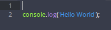
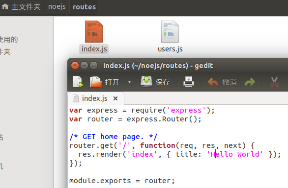
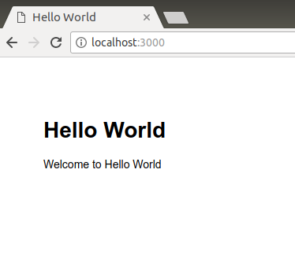

# Node.js
### 一、hello world
* 在sublime text中输入
```  
console.log('Hello World')
```


###### 保存为.js 后缀的文件名，在终端输入文件所在的位置，然后“运行node+文件名” 命令：


### 二、express
1. expres框架
(1.) express的功能：

* 路由控制；
* 模板解析支持；
* 动态视图；
* 用户会话；
* CSRF 保护；
* 静态文件服务；
* 错误控制器；
* 访问日志；
* 缓存；
* 插件支持；

2. 安装express
(1.)在google chrome中搜索“ubuntu14.04安装express4”关键字，进入"[ubuntu nodejs + express4.x 安装 测试](http://blog.csdn.net/ivanx_cc/article/details/46827291)"

(2.)根据教程中指示在终端输入命令，
* 安装express4.x，需要先执行以下配置 
```
npm config set registry http://registry.npmjs.org/
```
* 然后再进行安装（因为新版express-generator 与expres 分开了，所以要执行以下两个命令）
```
npm install express -g
npm install -g express-generator
```
* 安装完成后可以使用** express -V** 命令查看版本。


* 建立工程
通过以下命令建立网站基本结构:
```
express -t ejs microblog
```


* 创建文件夹（与上一步同理）
	* 在终端输入命令 express -e noejs添加文件夹。
	
* npm install


>提示我们要进入其中运行 npm install(自动安装了依赖 ejs 和 express)

* 检查package.json文件，文件内容显示如下：


>其中 dependencies 属性中有 express 和 ejs 。无参数的 npm install 的功能就是检查当前目录下的 package.json,并自动安装所有指定的依赖。

* npm start 运行express

* ctrl+c 结束运行


>这样启动一个服务就成功了， 可以通过 localhost：3000 在浏览器中访问欢迎页面。

3. 运行express
(1.)打开刚才新创建的 noejs文件夹下roultes文件夹中的index.js文件。
 
 
  
  
  
  
* 打开后文件内容如下图所示（此文件用于修改页面内容）。

 
 
 routes 是一个文件夹形式的本地模块,即 ./routes/index.js ,它的功能是为指定路径组织返回内容,相当于 MVC 架构中的控制器。
 
* 关闭此文件，打开noejs文件夹下的另一文件夹views中的index.ejs 文件,此文件中显示了内容的格式，关闭。


ejs (Embedded JavaScript) 是一个标签替换引擎,其语法与 ASP、 PHP 相似,易于学习,目前被广泛应用。 Express默认提供的引擎是 jade,它颠覆了传统的模板引擎,制定了一套完整的语法用来生成 HTML 的每个标签结构,功能强大但不易学习。

* 打开终端（ctrl+alt+t），输入命令打开noejs文件夹（cd+文件夹名），再输入noejs文件夹下运行express的命令（npm + start），打开浏览器输入网址：*localhost：3000*，输入ctrl+c 关闭express；


启动服务器，内容显示如下：


4. 注意！！！

* 当重新修改代码后，需要重启服务器才能呈现出更改后的效果，或者可以使用 supervisor 实现监视代码修改和自动重启。

5. <t style="color:red">三个 app.configure 函数:(分别指定了通用、开发和产品环境下的参数。)</t>
* 第一个 app.configure 直接接受了一个回调函数,后两个则只能在开发和产品环境中调用。
* app.set 是 Express 的**参数设置工具**,接受一个键(key)和一个值(value),可用的参数如下所示：
*  basepath :基础地址,通常用于 res.redirect() 跳转。
* views :视图文件的目录,存放模板文件。
* view engine :视图模板引擎。
* view options :全局视图参数对象。
* view cache :启用视图缓存。
* case sensitive routes :路径区分大小写。
* strict routing :严格路径,启用后不会忽略路径末尾的“ / ”。
* jsonp callback :开启透明的 JSONP 支持。

6. app.configure中启用的五个中间件：
* bodyParser：功能是解析客户端请求，通常是POST发送的内容。
* methodOverride：用于支持定制的HTTP的方法。
* router：是项目的路由支持。
* static：提供静态文件支持。
* errorHandler：错误控制器。

二. 文件夹的意义
1. bin ------目录：www文件更改端口
2. node_modules ------模板
3. public ---- image 存储图片，javascripts 存储js文件，stylesheets 页面风格存储CSS文件
