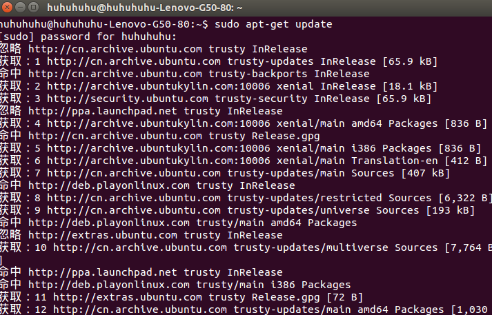
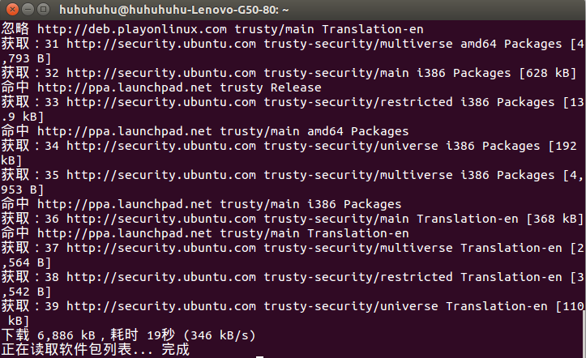
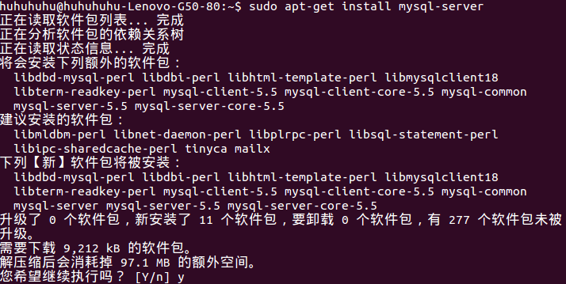
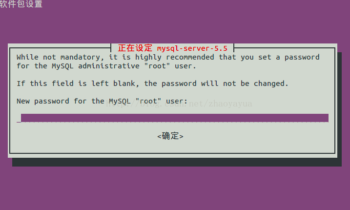
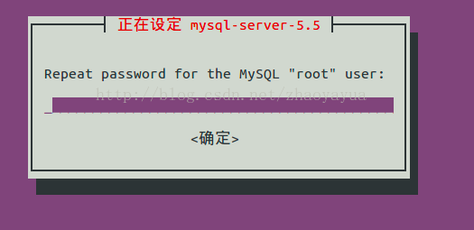
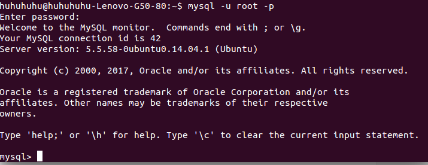
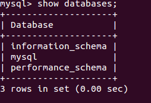
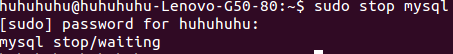

### 安装MySQL数据库
####　一、首先在Google浏览器搜索关键字“ubuntu14.04数据库安装”，选择一个安装MySQL的教程学习并进行实际操作；

参考教程：

* [如何在Ubuntu 14.04安装](MySQLhttps://www.howtoing.com/how-to-install-mysql-on-ubuntu-14-04)

* [ubuntu14.04下MySQL的安装与卸载](http://blog.csdn.net/zhaoyayua/article/details/38897393)

* [Ubuntu服务器常用配置－mysql数据库的安装](https://segmentfault.com/a/1190000002514402)

** 1、根据教程中的叙述，首先打开终端输入命令：sudo apt-get update，开始自动更新软件包 **

** 2、接着输入命令：sudo apt-get install mysql-server ,安装mysql**

* 输入"Y"继续执行后，设置MySQL使用时的root密码（密码设置自己能够轻易记住的）

* 再次输入密码；

** 3、安装完成后，输入 " mysql -u root -p " 命令，输入刚才设定好的密码，登录MySQL软件**

** 4、运行" show databases "命令，这样就显示已经链接sudo start mysql 成功了；**

5、停止MySQL，输入"sudo stop mysql"命令

#### 二、MySQL常用命令介绍：

* 运行命令：sudo start mysql 或者 sudo service mysql start
* 停止mysql：sudo stop mysql 或者 sudo service mysql stop
* 重启mysql：sudo restart mysql 或者 sudo service mysql restart